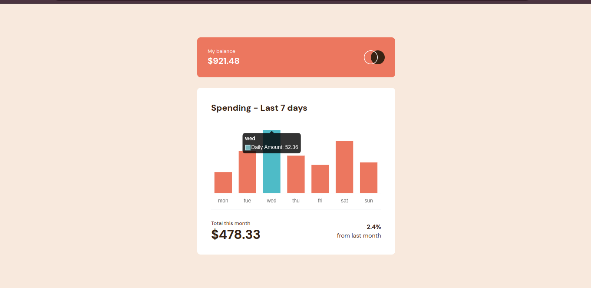
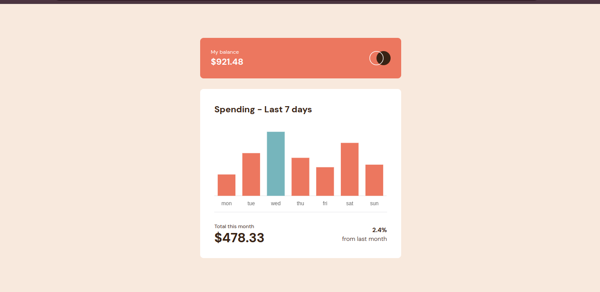
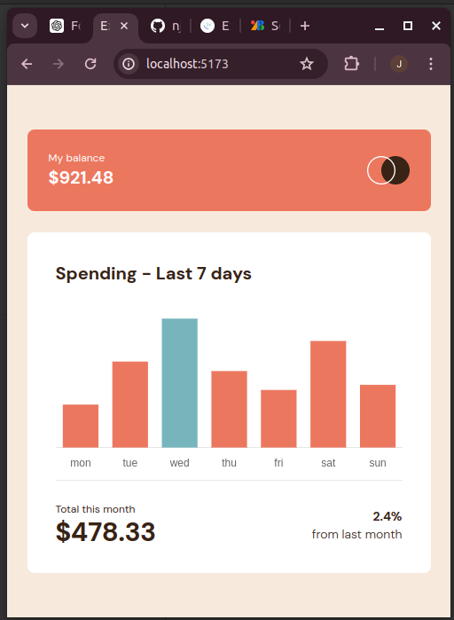

# Frontend Mentor - Expenses chart component solution

This is a solution to the [Expenses chart component challenge on Frontend Mentor](https://www.frontendmentor.io/challenges/expenses-chart-component-e7yJBUdjwt). Frontend Mentor challenges help you improve your coding skills by building realistic projects.

## Table of contents

- [Overview](#overview)
  - [The challenge](#the-challenge)
  - [Screenshot](#screenshot)
  - [Links](#links)
  - [Built with](#built-with)
  - [What I learned](#what-i-learned)
- [Author](#author)

## Overview

### The challenge

Users should be able to:

- View the bar chart and hover over the individual bars to see the correct amounts for each day
- See the current day’s bar highlighted in a different colour to the other bars
- View the optimal layout for the content depending on their device’s screen size
- See hover states for all interactive elements on the page
- **Bonus**: Use the JSON data file provided to dynamically size the bars on the chart

### Screenshot





### Links

- Solution URL: [https://github.com/njeruthuo/expense-chart](https://github.com/njeruthuo/expense-chart)
- Live Site URL: [https://expense-chart-dusky.vercel.app/](https://expense-chart-dusky.vercel.app/)

### Built with

- Flexbox
- Chartsjs
- CSS Grid
- TailwindCSS
- Mobile-first workflow
- [React](https://reactjs.org/) - JS library
- [Charts.js](http:google.com/charts.js/)
- [Styled Components](https://styled-components.com/) - For styles

### What I learned

Using chart.js to make responsive and dynamic charts.

```js
import { Bar } from "react-chartjs-2";
import weekData from "../data.json";

import {
  Chart as ChartJS,
  CategoryScale,
  LinearScale,
  BarElement,
  Title,
  Tooltip,
  Legend,
} from "chart.js";

ChartJS.register(
  CategoryScale,
  LinearScale,
  BarElement,
  Title,
  Tooltip,
  Legend
);

const BarGraph = () => {
  // Transform the data
  const labels = weekData.map((item) => item.day);
  const dataValues = weekData.map((item) => item.amount);

  // Find the maximum value
  const maxAmount = Math.max(...dataValues);

  // Set background colors with a different color for the max value
  const backgroundColors = dataValues.map((amount) =>
    amount === maxAmount ? "hsl(186, 34%, 60%)" : "hsl(10, 79%, 65%)"
  );

  const borderColors = dataValues.map((amount) =>
    amount === maxAmount ? "hsl(186, 34%, 60%)" : "hsl(10, 79%, 65%)"
  );

  // Chart.js data structure
  const data = {
    labels: labels,
    datasets: [
      {
        label: "Daily Amount",
        data: dataValues,
        backgroundColor: backgroundColors,
        borderColor: borderColors,
        borderWidth: 0,
      },
    ],
  };

  // Chart.js options
  const options = {
    responsive: true,
    plugins: {
      legend: {
        display: false, // Hide the legend
      },
      title: {
        display: false,
        text: "Daily Amounts",
      },
    },
    scales: {
      x: {
        ticks: {
          display: true, // Show x-axis labels (days of the week)
        },
        grid: {
          display: false, // Hide x-axis grid lines
        },
      },
      y: {
        display: false, // Hide the y-axis
        ticks: {
          display: false, // Hide y-axis labels
        },
        grid: {
          display: false, // Hide y-axis grid lines
        },
      },
    },
  };

  return <Bar data={data} options={options} />;
};

export default BarGraph;
```

## Author

- Website - [https://frontend-portfolio-amber.vercel.app/](https://frontend-portfolio-amber.vercel.app/)
- Frontend Mentor - [@njeruthuo](https://www.frontendmentor.io/profile/njeruthuo)
- Twitter - [@njeru19_njeru](https://www.twitter.com/njeru19_njeru)
